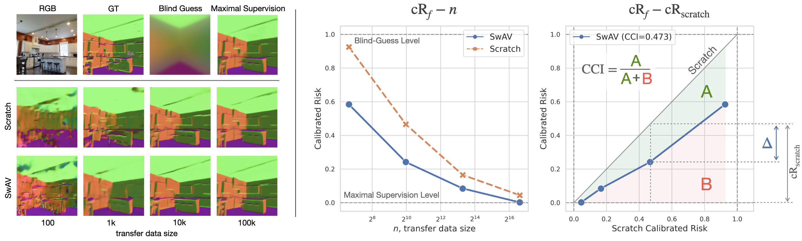
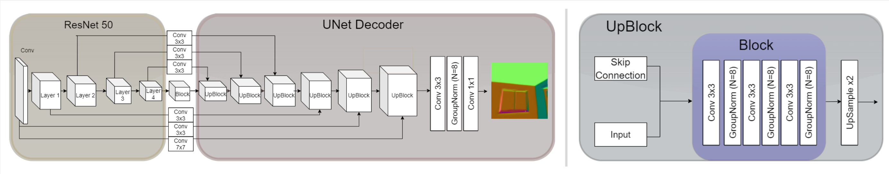

# Simple Control Baselines for Evaluating Transfer Learning


This repository contains the code for experiments from [Simple Control Baselines for Evaluating Transfer Learning](aaa).


<!-- Table of Contents -->
<!-- ================= -->

   * [Abstract](#abstract)
   * [Datasets and Downstream Tasks](#datasets-and-downstream-tasks)
   * [Download all pretrained models](#pretrained-models)
   * [Transfer a model](#transfer)
     * [Instructions for training](#steps)
     * [To train on a new middle domain](#to-train-from-new-middle-domain)
   * [Visualization](#visualization)
   * [Citing](#citation)


## Abstract

Transfer learning has witnessed remarkable progress in recent years, for example, with the introduction of augmentation-based contrastive self-supervised learning methods. While a number of large-scale empirical studies on the transfer performance of such models have been conducted, there is not yet an agreed-upon set of control baselines, evaluation practices, and metrics to report, which often hinders a nuanced and calibrated understanding of the real efficacy of the methods. We share an evaluation standard that aims to quantify and communicate transfer learning performance in an informative and accessible setup. This is done by baking a number of simple yet critical control baselines in the evaluation method, particularly the *blind-guess* (quantifying the dataset bias), *scratch-model* (quantifying the architectural contribution), and *maximal-supervision* (quantifying the upper-bound). To demonstrate how the proposed evaluation standard can be employed, we provide an example empirical study investigating a few basic questions about self-supervised learning. For example, using this standard, the study shows the effectiveness of existing self-supervised pre-training methods is skewed towards image classification tasks versus dense pixel-wise predictions. 


<br>
<center> 
   
   <figcaption><strong>Fig:</strong> summary of the evaluation standard</figcaption>
</center> 

## Datasets and downstream tasks
#### Classification Tasks
[ImageNet](https://www.image-net.org/), [CIFAR-100](https://www.cs.toronto.edu/~kriz/cifar.html), and [EuroSAT](https://github.com/phelber/eurosat).

#### Pixel-wise Tasks
[Taskonomy](http://taskonomy.stanford.edu/) for depth and surface normals estimation.

## Pretrained models
#### Network architecture
All pre-trained encoders share the same [ResNet-50](https://arxiv.org/pdf/1512.03385.pdf) architecture. 
For transfers to downstream tasks, we use two types of decoders. 
For classification tasks, we use a single fully-connected layer that takes the output of the final encoder’s layer and outputs the logits for each class. 
For pixel-wise regression tasks, we use a [UNet-style](https://arxiv.org/pdf/1505.04597.pdf) decoder with six upsampling blocks and skip-connections from the encoder layers of the same spatial resolution. 



#### Download the models
- A full list of pre-training models we used is in the table below:
   | Method | URL|   
   |---|---|
   |**Contrastive Self-Supervised Learning**||
   |[SwAV](https://arxiv.org/pdf/2006.09882.pdf)| [model](https://dl.fbaipublicfiles.com/deepcluster/swav_800ep_pretrain.pth.tar) |
   |[MoCov2](https://arxiv.org/pdf/2003.04297.pdf)| [model](https://dl.fbaipublicfiles.com/moco/moco_checkpoints/moco_v2_800ep/moco_v2_800ep_pretrain.pth.tar) |
   |[SimCLR](https://arxiv.org/pdf/2002.05709.pdf)| [model](https://dl.fbaipublicfiles.com/vissl/model_zoo/simclr_rn50_800ep_simclr_8node_resnet_16_07_20.7e8feed1/model_final_checkpoint_phase799.torch) |
   |[SimSiam](https://arxiv.org/pdf/2011.10566.pdf)| [model](https://dl.fbaipublicfiles.com/simsiam/models/100ep-256bs/pretrain/checkpoint_0099.pth.tar) |
   |[Barlow Twins](https://arxiv.org/pdf/2103.03230.pdf)| [model](https://dl.fbaipublicfiles.com/vissl/model_zoo/barlow_twins/barlow_twins_32gpus_4node_imagenet1k_1000ep_resnet50.torch) |
   |[PIRL](https://arxiv.org/pdf/1912.01991.pdf)| [model](https://dl.fbaipublicfiles.com/vissl/model_zoo/pirl_jigsaw_4node_pirl_jigsaw_4node_resnet_22_07_20.34377f59/model_final_checkpoint_phase799.torch) |
   |**Non-Contrastive Pretext Tasks**||
   |[Colorization](https://arxiv.org/pdf/1603.08511.pdf)| [model](https://dl.fbaipublicfiles.com/vissl/model_zoo/converted_vissl_rn50_colorization_in1k_goyal19.torch) |
   |[Jigsaw](https://arxiv.org/pdf/1603.09246.pdf)| [model](https://dl.fbaipublicfiles.com/vissl/model_zoo/converted_vissl_rn50_jigsaw_in1k_goyal19.torch) |


## Transfer
#### Download the pretrained models
If you haven't yet, then download the [pretrained models](#pretrained-models) and [datasets](#datasets-and-downstream-tasks) needed.

#### Main code structure
```python
.
├── data/                          # Dataset modules
├── downstream_tasks/              # Downstream task module
├── imagenet_cls/                  # Codes for ImageNet classification
├── link_modules/                  # Link modules to connect encoder and decoder
├── models/                        # Network definition
├── representation_tasks/          # Different feature extractor modules
├── utils/                         # Some utils
├── train_ssl2taskonomy.py         # Main code for training on Taskonomy
├── run_cls.sh                     # Training script for CIFAR100/EuroSAT
└── run_taskonomy.sh               # Training script for Taskonomy
```

#### Training scritps
Note that we provide 3 shell scripts for different task trainings.

- Transfer self-supervised methods to Taskonomy dataset:
```bash
bash run_taskonomy.sh
```
Please change `--ssl_name` and `--taskonomy_domain` accordingly. The model names and taskonomy domains we support are detailed in [train_ssl2taskonomy.py](./train_ssl2taskonomy.py).

- Transfer self-supervised methods to ImageNet classification:
```bash
cd imagenet_cls
bash train_cls.sh
```
Please change `--model_name` accorodingly. The model names we support are detailed in [imagenet_ssl_epoch.py](./imagenet_cls/imagenet_ssl_epoch.py).

- Transfer self-supervised methods to CIFAR100/EuroSAT datasets:
```bash
bash run_cls.sh
```
Please change `--ssl_name` and `--taskonomy_domain` accordingly. The model names and taskonomy domains we support are detailed in [train_ssl2taskonomy.py](./train_ssl2taskonomy.py).

#### Freeze and unfreeze the feature extractor
To freeze the feature extractor and only update the decoder parts or the classifier parts, please enable
`--freeze_representation` in the training scripts.

#### Logging
The losses and visualizations are logged in [Weights & Biases](https://www.wandb.com/).

## Visualization

You can find the plotting example in the [`Vizualization-Example.ipynb`](./Plotting-Example.ipynb) notebook. It assumes a `.csv` file with the following columns: `domain, method, train_size, test_loss, seed`. An example of the results file from our evaluation is [`./assets/ssl-results.csv`](./assets/ssl-results.csv).

## Citation

If you find this paper or code useful, please cite this paper:
```
@article{atanov2022simple,
      title={Simple Control Baselines for Evaluating Transfer Learning}, 
      author={Atanov, Andrei and Xu, Shijian and Beker, Onur and Filatov, Andrei and Zamir, Amir},
      year={2022},
      journal={arXiv preprint arXiv:2202.03365},
}
```